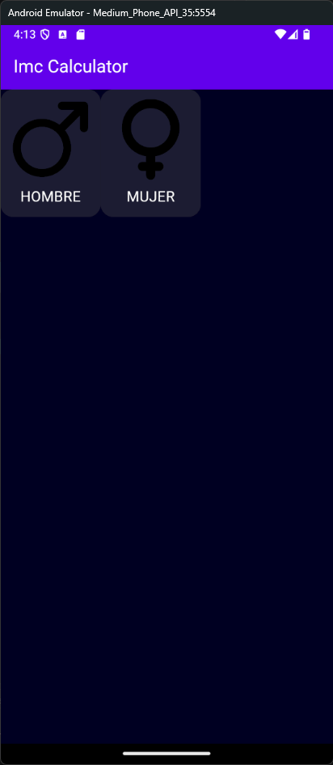

# imc_calculator

A new Flutter project.

---

paso 1 ir al `pubspec yaml`  y cambiar la `description` y si uno quiere el `publish to`

---

paso 2 crear estructura de carpetas , `components`, `core` y `screen` dentro de `lib`

---

# screen

aca van  vistas completas de la app

- `home_screen.dart`
- `login_screen.dart`

Normalmente una screen:

- arma la estructura general de esa página
- usa varios widgets/componentes dentro
- puede conectarse con lógica o estado

---

# Components

son widget reutilizables más pequeños que puedes usar en varias pantallas,

## Ejemplos

- Boton personalizado
- Tarjeta
- Un campo de texto reutilizable
- un item de lista

---

# Core

Como el nombre bien lo dice, es el nucleo,

aca se suele guardar las cosas que no son para una sola pantalla, Ejemplo

Por ejemplo

- Colores globales,
- Theme
- rutas
- constantes
- helpers
- utilidades
- configuracion
- servicios comunes
- estilos de testo
- valores fijos de la app

## Ejemplos concretos:

- `core/theme/app_theme.dart`
- `core/constants/colors.dart`
- `core/utils/formatters.dart`

es decir: La idea del core es guardar lo que sirve como fundamento del proyecto.\

---

# Resumen fácil

Imagina una casa:

- Screens = las habitaciones completas
- Components = los muebles o piezas dentro de las habitaciones
- Core = la electricidad, reglas, materiales base y diseño general de toda la casa

`main.dart -> screens -> components -> core`

---

# Algo importante

En flutter hay muchas formas de organizar:

- Por tipo (`screens`, `widgets`, `services`)
- por feature(`auth`, `chat`, `products`)
- por capas(`data`, `domain`, `presentation`)

---

paso 3:

lib/core/app_colors.dart

```dart

import 'package:flutter/material.dart';

class AppColors {

  static const Color primary = Color(0xFF6200EB);
  static const Color secondary = Color(0xFF1F0344);
  static const Color accent = Color(0xFFFFC401);

  //Backgrounds
  static const Color background = Color(0xFF0E0B20);
  static const Color backgroundComponent = Color(0xFF1D1E32);
  static const Color backgroundComponentSelected = Color(0xFF4F548B);

}
```

notar el AppBar

```dart
class MainApp extends StatelessWidget {
  const MainApp({super.key});

  @override
  Widget build(BuildContext context) {
    return MaterialApp(
      debugShowCheckedModeBanner: false,
      home: Scaffold(

        appBar: AppBar(
          backgroundColor: AppColors.primary,
          foregroundColor: Colors.white,
          title: Text("Imc Calculator")
          
          ),
        backgroundColor: AppColors.background,

        body: const Center(
          child: Text('Hello World!'),
        ),
      ),
    );
  }
}
```

paso 4: 
En el codigo anterior se puede notar un body de mierda
por lo que se hara la primera screen

# Diferencia entre statefullwidget y statelesswidget


- **StatelessWidget**: si nada de la vista cambia, se usa `StatelessWidget`.
- **StatefulWidget**: si algo de la vista cambia, se usa `StatefulWidget`.

es decir si el estado cambia o no

Cuando hablamos de “cambiar”, nos referimos a que **la interfaz cambia en pantalla**, por ejemplo:

- cambia un número
- aparece un mensaje
- se actualiza un color
- se marca o desmarca una opción

entonces creamos imc_home_screen.dart

```dart
import 'package:flutter/material.dart';

class ImcHomeScreen extends StatefulWidget {
  const ImcHomeScreen({super.key});

  @override
  State<ImcHomeScreen> createState() => _ImcHomeScreenState();
}

class _ImcHomeScreenState extends State<ImcHomeScreen> { //notar qque es privado
  @override
  Widget build(BuildContext context) {
    return const Placeholder();
  }
}
```


```
 recuerda los pasos para tener imagenes locales, primero crear la carpeta
assets/images
y meter imagenes ahi , preferiblemente png

luego en el pubspec.yaml

```yaml


flutter:
  uses-material-design: true
  assets:
    - assets/images/

```

---

y los componentes que tendran la vista para luego importarlo

```dart

class _GenderSelectorState extends State<GenderSelector> {
  @override
  Widget build(BuildContext context) {
    return Row(
      children: [
        
        //Uomo
        Column(
          children: [
            Image.asset("assets/images/male.png", height: 100,),
            Text("Hombre".toUpperCase(), 
            style: TextStyle(color: Colors.white, fontSize: 18))
          ],
        ),

      //Donna
        Column(
          children: [

             Image.asset("assets/images/female.png", height: 100,),
            Text("Mujer".toUpperCase(), 
            style: TextStyle(color: Colors.white, fontSize: 18)) //nota que repetimos el mismo Texstyle de mas arriba

          ],
        )
      ],
    );
  }
}
 ```

 * notar el TextStyle repetido, que vamos hacer para que no se repita?

 facil , creamos text_styles.dart dentro del core
 
 
 ```dart

import 'package:flutter/material.dart';

class TextStyles {
  static const TextStyle bodyText = TextStyle(color: Colors.white, fontSize: 18);
}
```

y ahora reemplazamos el codigo en el gender_selector.dart

```dart

  //Donna
        Column(
          children: [

             Image.asset("assets/images/female.png", height: 100,),
            Text("Mujer".toUpperCase(), 
            style: TextStyles.bodyText) //nota que repetimos el mismo Texstyle de mas arriba

          ],
        )

```

y ahora se notara que estamos usando la variable estatica, esto sirve porque si en algun dia hay que cambiar el estilo del texto , no se debera cambiar 1 por 1, solo se ira al archivo del core, en este caso text_styles.dart y modificamos todo mas facil

ahora wrapearemos la Columna dentro de un container para usar box decoration



como se podra notar no ocupa todo su ancho entonnces meteremos cada container en un expanded

```dart

 Expanded(
          child: Container(
            decoration: BoxDecoration(
              // color: Colors.red,
          
            color: selectedGender == "Mujer"
            ? AppColors.backgroundComponentSelected
            : AppColors.backgroundComponent,
              
              borderRadius: BorderRadius.circular(16)
              ),
            child: Padding(
              padding: const EdgeInsets.all(12.0),
              child: Column(
                children: [
              
                   Image.asset("assets/images/female.png", height: 100,),
                  SizedBox(height: 8,),
                  Text("Mujer".toUpperCase(), 
                  style: TextStyles.bodyText) //nota que repetimos el mismo Texstyle de mas arriba
              
                ],
              ),
            ),
          ),
        )
      ],
    );

  ```

ahora a cada containter, se lo wrapea en un padding (si de nuevo) para darle separacion entre ellos 

```dart

   child: Padding(
            padding: const EdgeInsets.only(right: 8, bottom: 16, left: 16,top: 16),

```
por que a la derecha solo 8, facil para darle 8 a la izquierda de mujer y sumen 16 entre los 2


---

Ahora esta todo bonito pero el boton no es clickeable, pero por suerte en flutter
cualquier widget puede der clickeable si lo envolvemos dentro de un tap gesture

```dart
// asi quedo el codigo
String? selectedGender;

  @override
  Widget build(BuildContext context) {
    return Row(
      children: [
        
        //Uomo
        Expanded(
          child: GestureDetector(
            onTap: () {

              setState(() {
                selectedGender = "Hombre";
              });
            },
            child: Padding(
              padding: const EdgeInsets.only(top: 16,right: 8, bottom: 16, left: 16),
              child: Container(
                decoration: BoxDecoration(
                  // color: Colors.red,
              
                color: selectedGender == "Hombre"
                ? AppColors.backgroundComponentSelected
                : AppColors.backgroundComponent,
                  
                  borderRadius: BorderRadius.circular(16)
                ),
                child: Padding(
                  padding: const EdgeInsets.all(12.0),
                  child: Column(
                    children: [
                      Image.asset("assets/images/male.png", height: 100,),
                      SizedBox(height: 8,), // Tambien se podia haber usado un padding top
                      Text("Hombre".toUpperCase(), 
                      style: TextStyles.bodyText)
                    ],
                  ),
                ),
              ),
            ),
          ),
        ),
  ```

  * Notar qque se esta usando String para asignar valor a la variable selectedGender, en un mundo ideal se usan numeros

  ### fin de gender selector?

  